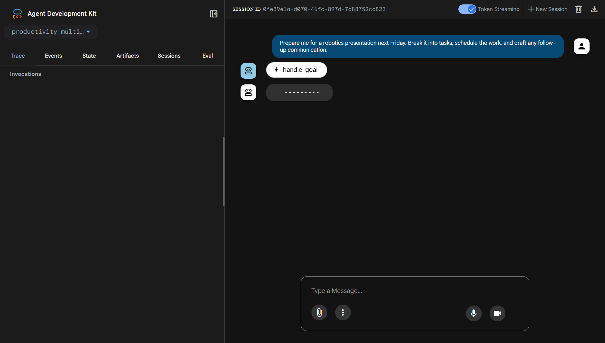
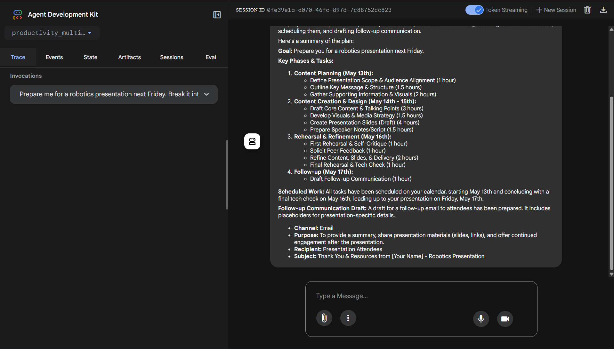

# Aegis

Aegis is a cloud-native multi-agent productivity system built to turn a vague user goal into a structured, executable workflow. Instead of stopping at recommendations, Aegis plans the work, converts that plan into tool actions, records the resulting artifacts, and exposes the state of execution back to the user through a Google ADK interface.

This project was designed to address a common gap in modern AI assistants: many systems can generate advice, but very few can coordinate planning, execution, and visible follow-through in a way that resembles a real operational workflow. Aegis closes that gap by combining a master agent with specialized planning, execution, and tool services in a deployable Google Cloud architecture.

## Product Snapshot

The first view shows Aegis processing a user request through the ADK interface, with the agent actively invoking the workflow.



The second view shows the agent returning a structured outcome after planning the work, scheduling the execution path, and drafting follow-up communication.



## What Aegis does

At a high level, a user can give Aegis a goal such as:

`Prepare me for a robotics presentation next Friday. Break it into tasks, schedule the work, and draft any follow-up communication.`

Aegis then performs four major steps:

1. It accepts the goal in a Google ADK-powered UI through the root agent.
2. It sends the goal to a planning service that converts the request into a structured execution plan.
3. It sends that plan to an execution service that translates planned tasks into tool-level actions.
4. It stores and exposes the resulting state through a centralized MCP service that manages tasks, calendar events, email drafts, and workspace snapshots.

The result is a productivity system that can move from intent to action while still preserving transparency. A user can see not only what the system thought, but also what it created and what state now exists inside the workspace.

## The problem this project solves

Modern productivity work is fragmented. A user may think through a task in one place, create action items in another, schedule time in a calendar, send updates separately, and still have no clean view of what was completed. Even when AI is introduced, the experience is often limited to advice or chat responses that never translate into operational outcomes.

Aegis addresses that fragmentation by separating the workflow into specialized agents and services:

- one layer understands the user’s intent
- one layer structures the work
- one layer executes the work
- one layer records and exposes the artifacts

That separation makes the system clearer, more extensible, and more realistic for real-world deployment.

## Core idea and architecture

The project follows a multi-agent pattern with one orchestrating agent and three supporting services.

### 1. Root Agent

The root agent is the user-facing master agent built with Google ADK. It is responsible for:

- receiving the user’s goal
- invoking the planning workflow
- invoking the execution workflow
- retrieving workspace snapshots when needed
- returning a concise final response grounded in actual system outputs

This gives the project a clear control plane. The root agent is not overloaded with every responsibility; instead, it acts as the coordinator for specialized components.

### 2. Planner Service

The planner is responsible for transforming an unstructured goal into a machine-usable plan. It produces:

- a goal summary
- task objects
- task priorities
- dependencies
- schedule hints
- risks
- optional communication requirements

The planner supports two modes:

- a heuristic fallback planner for reliability
- an optional Gemini / Vertex-powered planner for richer structured plans

This makes the planning stage more credible than a static task splitter. The output is intended to resemble an operational plan rather than a casual checklist.

### 3. Executor Service

The executor converts the plan into actions. It reads either a structured plan or raw tasks and maps each item into MCP operations such as:

- creating a task record
- creating a calendar event
- drafting an email

It also supports dry-run mode, which is useful for debugging and demonstrations because it allows the team to preview the exact actions the system would take without mutating workspace state.

### 4. MCP Service

The MCP service acts as the centralized tool layer and workspace state manager. It exposes endpoints for:

- task creation
- task status updates
- calendar event creation
- email drafting
- email sending
- snapshot retrieval

It can run with in-memory storage for quick demos or Firestore-backed persistence for a more realistic Cloud Run deployment. This makes the project better aligned with how a real production service would evolve.

## End-to-end workflow

The intended system loop is:

`User goal -> Root agent -> Planner -> Executor -> MCP tools -> Workspace snapshot -> User`

A typical example looks like this:

1. The user asks for help preparing a robotics presentation.
2. The planner breaks that request into tasks such as clarifying the goal, gathering supporting material, drafting the narrative, rehearsing, and requesting feedback.
3. The executor turns those tasks into concrete actions such as creating task entries, placing review events onto a schedule, and drafting a feedback email.
4. The MCP service stores the resulting artifacts.
5. The root agent can then report back with a summary of what was planned and what was created.

This is the central idea of the project: the user is not just talking to a model, but interacting with a system that can reason, act, and reflect state back.

## Why the design is meaningful

This architecture is intentionally modular.

- The planning layer can improve independently without rewriting the tool layer.
- The execution layer can expand to support additional tools without changing the root interaction model.
- The MCP layer can move from mocks to real integrations gradually.
- The system can scale across services because each responsibility is isolated.

That modularity matters for both hackathon judging and long-term product realism. It shows that the project is not just a single script wrapped in a UI, but a system with clear service boundaries and a believable evolution path.

## Google technologies used

Aegis is designed around the Google AI and Google Cloud ecosystem:

- **Google ADK** for the root agent and developer UI
- **Gemini / Vertex AI** for structured planning when model-based planning is enabled
- **Cloud Run** for service deployment, isolation, and scaling
- **Firestore** for optional persistent workspace state
- **Google-signed identity tokens** for private service-to-service invocation across Cloud Run services

These choices support a strong deployment story. The project is not locked into a local prototype pattern; it is designed to be hosted as a real multi-service application with a secure interaction model.

## What makes Aegis different

Many AI productivity tools stop at suggestions. Aegis goes further by creating a closed loop between user intent, structured planning, executable actions, and observable workspace state.

That difference matters because it changes the product from a passive assistant into an operational system. Instead of telling a user what they should probably do, Aegis can break work down, create records, schedule actions, draft communication, and return a stateful summary of what happened.

## Why this is more than a chatbot demo

Many AI demos stop after generating a response. Aegis is stronger because it demonstrates:

- intent understanding
- structured decomposition
- autonomous action mapping
- persistent artifact creation
- visibility into execution results
- deployable service boundaries

That is a more convincing expression of agentic productivity software than a single prompt-response loop.

## Repository structure

Only the project files relevant to understanding and running the system are kept in the repository.

```text
agents/main_agent/root_agent.py   Root ADK agent and system coordinator
planner/app.py                    Structured planning service
executor/app.py                   Execution service that converts plans into actions
mcp/app.py                        Tool service and workspace state layer
agent.py                          Package entry for ADK app loading
root_agent.yaml                   ADK root agent mapping
planner/Procfile                  Cloud Run process entry for planner
executor/Procfile                 Cloud Run process entry for executor
mcp/Procfile                      Cloud Run process entry for MCP
```

## Current strengths

- The architecture is clean and explainable.
- The planner returns structured plans rather than plain text.
- The executor supports actionable workflows instead of suggestion-only outputs.
- The MCP service provides workspace visibility, which is critical for trust.
- The system is already aligned with Cloud Run deployment patterns.

## Future product extensions

The current version demonstrates the system design well, but it also points naturally to a richer roadmap:

- real calendar and email integrations
- external collaboration tool support such as Slack
- approval checkpoints for sensitive actions
- richer long-term task memory
- analytics and observability dashboards
- role-based workspaces for teams

This makes the project a strong prototype not only because of what it does now, but because it clearly suggests how it can become a production-grade AI operations assistant.

## Presentation summary

If this README had to stand in for a verbal project presentation, the core message would be:

Aegis is a multi-agent productivity system that transforms user intent into structured execution. It combines an ADK-powered root agent, a planner, an executor, and a centralized MCP tool layer to create a closed loop from goal intake to observable action. It is designed not as a toy chat demo, but as a cloud-native architecture that can realistically evolve into a production productivity platform.
